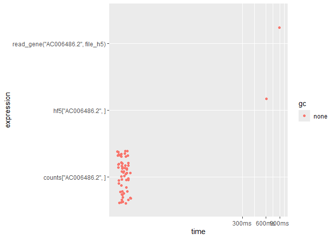

Not enough memory? HDF5, a data format for single cell RNAseq data
================
2024-02-23

# start point

The starting point for this task is that we have a sparse count matrix,
maybe a `Seurat` or `SingleCellExperiment` object that I want to make
accessible via a shiny app to stakeholders. I can write an app that just
simply works with these objects directly, but that would involve loading
the several gigabytes of data into memory.

I was looking for ways to circumvent loading entire count matrices (the
main memory-hungry culprit) into R, and this post is about that
exploration.

The outline for this post is that: there are some great “on-disk”
streaming options, where essentially you open a *connection* to a file,
then only subsets of the data file that you request are actually read
into memory.

# the plan

Actually, there is already a great memory-efficient solution out there
called \[ShinyCell\](<https://github.com/SGDDNB/ShinyCell>\], which
utilizes the HDF5 format. This doesn’t work perfectly for me though,
because I have my own app functions and framework that I want to apply.
I am just interested in the memory-efficient data read functionality.

So I will compare ShinyCell’s rather manual h5 strategy to some other
options. The other option included here is `HDF5Array` + `delayedArray`,
which are some Bioconductor options specifically for
Bioconductor-specific data structures, like scRNAseq.

# key packages for this post

For HDF5, there are a couple of general purpose options in R:
[hdf5r](https://cran.r-project.org/web/packages/hdf5r/index.html),
[rhdf5](https://bioconductor.org/packages/release/bioc/html/rhdf5.html).
Then there is the bioconductor package
[HDF5Array](https://bioconductor.org/packages/release/bioc/html/HDF5Array.html)
which uses `hdf5r` in backend to work with bioconductor data structures
specifically.

# other packages

`HDF5Array` hdf5 read write dense/sparse matrices `hdf5r` hdf5 r
implementation `scRNAseq` to access example scRNAseq dataset `tidyverse`
`glue` `gt` general purpose data wrangling `tictoc` `bench` timing

``` r
library(HDF5Array)
library(hdf5r)
library(scRNAseq)
library(tidyverse)
library(tictoc)
library(withr)
library(bench)
library(gt)
library(glue)
```

``` r
sce <- ZilionisLungData()
```

    ## see ?scRNAseq and browseVignettes('scRNAseq') for documentation

    ## loading from cache

    ## see ?scRNAseq and browseVignettes('scRNAseq') for documentation

    ## loading from cache

``` r
counts <- sce@assays@data$counts[1:2000,]
```

# saving dgc matrix manually with hdf5r

This is shinycell’s approach, which is to write the sparse count matrix
of a seurat / singlecellexperiment object to a dense representation on
disk. Because converting the sparse matrix to dense would implode most
computers, shinycell’s approach is to do this in chunks / loops.

I modify the code to make it easier to follow, and I litter the function
with `tictoc::tic` and `toc` to monitor the overall and each step takes.

Alternatively, we could write sparse representation to disk, which would
be faster to write (less data), but then we would need to convert to
dense on the read-in endpoints. I don’t do that here, because the goal
is to speed up read-in, not write-out. Though it may be trivially fast
to coerce a 1 x 1million vector? Am not sure.

``` r
file_h5 <- here::here('data','counts.h5')
if (file.exists(file_h5)) file.remove(file_h5)
```

    ## [1] TRUE

``` r
write_dgc_to_h5 <- function(dgc, file, chunk_size = 500) {
  
  # open h5 connection and groups
  h5 <- H5File$new(file, mode = "w")
  on.exit(h5$close_all())
  h5_grp <- h5$create_group("grp")
  h5_grp_data <- h5_grp$create_dataset(
    "data",  
    dtype = h5types$H5T_NATIVE_FLOAT,
    space = H5S$new("simple", dims = dim(dgc), maxdims = dim(dgc)),
    chunk_dims = c(1, ncol(dgc))
  )
  
  tic('total')
  for (i in 1:floor((nrow(dgc) - 8)/chunk_size)) {
    
    index_start <- ((i - 1) * chunk_size) + 1
    index_end <- i * chunk_size
    tic(glue::glue('loop {i}, rows {index_start}:{index_end}'))
    
    h5_grp_data[index_start:index_end, ] <- dgc[index_start:index_end,] |> 
      as.matrix()
    toc(log = TRUE)
  }
  
  # final group
  index_start <- i*chunk_size + 1
  index_end <- nrow(dgc)
  
  tic(glue::glue('final loop, rows {index_start}:{index_end}'))
  h5_grp_data[index_start:index_end, ] <- as.matrix(dgc[index_start:index_end, ])
  toc(log = TRUE)
  
  # add rownames and colnames
  h5_grp[['rownames']] <- rownames(dgc)
  h5_grp[['colnames']] <- colnames(dgc)
  toc()
}
write_dgc_to_h5(counts, file_h5, chunk_size = 1000)
```

    ## Warning in asMethod(object): sparse->dense coercion: allocating vector of size
    ## 1.3 GiB

    ## loop 1, rows 1:1000: 8.48 sec elapsed

    ## Warning in asMethod(object): sparse->dense coercion: allocating vector of size
    ## 1.3 GiB

    ## final loop, rows 1001:2000: 6.99 sec elapsed
    ## total: 15.56 sec elapsed

# read 1 gene at a time

``` r
read_gene <- function(gene, file_h5) {
  #tic('whole thing')
  stopifnot(file.exists(file_h5))
  # open connections
  #tic('open')
  h5 <- H5File$new(
    file_h5, 
    mode = "r")
  
  #on.exit(h5$close_all())
  
  h5_data <- h5[['grp']][['data']]
  h5_rownames <- h5[['grp']][['rownames']]
  h5_colnames <- h5[['grp']][['colnames']]
  
  #toc()
  #tic('read gene')
  ind <- str_which(h5_rownames[], gene)
  #ind <- 18871
  #print(ind)
  gene <- h5_data[ind,]
  #toc()
  
  #tic('set name')
  gene <- setNames(gene, nm = h5_colnames[])
  #toc()
  
  #tic('close')
  h5$close_all()
  #toc()
  #toc()
  return(gene) 
}


gene <- read_gene('AC006486.2', file_h5)
```

# HDF5array

Bioconductor has the HDF5array R package that supports writing / loading
dense and sparse matrices from .h5 files.

Let’s see how this compares to my manual implementation.

First write to disk using `HDF5Array::writeHDF5Array`

``` r
file_h5array <- here::here('data', 'HDF5array.h5')
if (file.exists(file_h5array)) file.remove(file_h5array)
```

    ## [1] TRUE

``` r
tic();HDF5Array::writeHDF5Array(
  DelayedArray(counts), 
  file_h5array, as.sparse = FALSE, name = 'full', with.dimnames = TRUE);toc()
```

    ## <2000 x 173954> HDF5Matrix object of type "double":
    ##            bcIIOD bcHTNA bcDLAV ... bcELDH bcFGGM
    ##    5S_rRNA      0      0      0   .      0      0
    ##  5_8S_rRNA      0      0      0   .      0      0
    ##        7SK      0      0      0   .      0      0
    ##       A1BG      0      0      0   .      0      0
    ##   A1BG-AS1      0      0      0   .      0      0
    ##        ...      .      .      .   .      .      .
    ## AC010247.2      0      0      0   .      0      0
    ## AC010255.1      0      0      0   .      0      0
    ## AC010255.2      0      0      0   .      0      0
    ## AC010255.3      0      0      0   .      0      0
    ## AC010260.1      0      0      0   .      0      0

    ## 18.76 sec elapsed

``` r
h5ls(file_h5array)
```

    ##             group           name       otype dclass           dim
    ## 0               / .full_dimnames   H5I_GROUP                     
    ## 1 /.full_dimnames              1 H5I_DATASET STRING          2000
    ## 2 /.full_dimnames              2 H5I_DATASET STRING        173954
    ## 3               /           full H5I_DATASET  FLOAT 2000 x 173954

``` r
hf5 <- HDF5Array(file_h5array,  name = 'full', as.sparse = TRUE)
hf5['AC006486.2',] |>  head()
```

    ## bcIIOD bcHTNA bcDLAV bcHNVA bcALZN bcEIYJ 
    ##      0      0      0      0      0      0

``` r
showtree(hf5)
```

    ## 2000x173954 double, sparse: HDF5Matrix object
    ## └─ 2000x173954 double, sparse: [seed] HDF5ArraySeed object

``` r
showtree(hf5[2,])
```

    ##  double: [seed] numeric object

``` r
class(hf5)
```

    ## [1] "HDF5Matrix"
    ## attr(,"package")
    ## [1] "HDF5Array"

``` r
is(hf5, 'DelayedMatrix')
```

    ## [1] TRUE

# compare HDF5array vs diy implementation

Compare performance

``` r
bench_read <- bench::mark(
  hf5['AC006486.2',],
  read_gene('AC006486.2', file_h5),
  counts['AC006486.2',]
)  

summary(bench_read) |> select(-memory, -result, -time, -gc) |>  gt()
```

<div id="tlqwgwiwbp" style="padding-left:0px;padding-right:0px;padding-top:10px;padding-bottom:10px;overflow-x:auto;overflow-y:auto;width:auto;height:auto;">
<style>#tlqwgwiwbp table {
  font-family: system-ui, 'Segoe UI', Roboto, Helvetica, Arial, sans-serif, 'Apple Color Emoji', 'Segoe UI Emoji', 'Segoe UI Symbol', 'Noto Color Emoji';
  -webkit-font-smoothing: antialiased;
  -moz-osx-font-smoothing: grayscale;
}
&#10;#tlqwgwiwbp thead, #tlqwgwiwbp tbody, #tlqwgwiwbp tfoot, #tlqwgwiwbp tr, #tlqwgwiwbp td, #tlqwgwiwbp th {
  border-style: none;
}
&#10;#tlqwgwiwbp p {
  margin: 0;
  padding: 0;
}
&#10;#tlqwgwiwbp .gt_table {
  display: table;
  border-collapse: collapse;
  line-height: normal;
  margin-left: auto;
  margin-right: auto;
  color: #333333;
  font-size: 16px;
  font-weight: normal;
  font-style: normal;
  background-color: #FFFFFF;
  width: auto;
  border-top-style: solid;
  border-top-width: 2px;
  border-top-color: #A8A8A8;
  border-right-style: none;
  border-right-width: 2px;
  border-right-color: #D3D3D3;
  border-bottom-style: solid;
  border-bottom-width: 2px;
  border-bottom-color: #A8A8A8;
  border-left-style: none;
  border-left-width: 2px;
  border-left-color: #D3D3D3;
}
&#10;#tlqwgwiwbp .gt_caption {
  padding-top: 4px;
  padding-bottom: 4px;
}
&#10;#tlqwgwiwbp .gt_title {
  color: #333333;
  font-size: 125%;
  font-weight: initial;
  padding-top: 4px;
  padding-bottom: 4px;
  padding-left: 5px;
  padding-right: 5px;
  border-bottom-color: #FFFFFF;
  border-bottom-width: 0;
}
&#10;#tlqwgwiwbp .gt_subtitle {
  color: #333333;
  font-size: 85%;
  font-weight: initial;
  padding-top: 3px;
  padding-bottom: 5px;
  padding-left: 5px;
  padding-right: 5px;
  border-top-color: #FFFFFF;
  border-top-width: 0;
}
&#10;#tlqwgwiwbp .gt_heading {
  background-color: #FFFFFF;
  text-align: center;
  border-bottom-color: #FFFFFF;
  border-left-style: none;
  border-left-width: 1px;
  border-left-color: #D3D3D3;
  border-right-style: none;
  border-right-width: 1px;
  border-right-color: #D3D3D3;
}
&#10;#tlqwgwiwbp .gt_bottom_border {
  border-bottom-style: solid;
  border-bottom-width: 2px;
  border-bottom-color: #D3D3D3;
}
&#10;#tlqwgwiwbp .gt_col_headings {
  border-top-style: solid;
  border-top-width: 2px;
  border-top-color: #D3D3D3;
  border-bottom-style: solid;
  border-bottom-width: 2px;
  border-bottom-color: #D3D3D3;
  border-left-style: none;
  border-left-width: 1px;
  border-left-color: #D3D3D3;
  border-right-style: none;
  border-right-width: 1px;
  border-right-color: #D3D3D3;
}
&#10;#tlqwgwiwbp .gt_col_heading {
  color: #333333;
  background-color: #FFFFFF;
  font-size: 100%;
  font-weight: normal;
  text-transform: inherit;
  border-left-style: none;
  border-left-width: 1px;
  border-left-color: #D3D3D3;
  border-right-style: none;
  border-right-width: 1px;
  border-right-color: #D3D3D3;
  vertical-align: bottom;
  padding-top: 5px;
  padding-bottom: 6px;
  padding-left: 5px;
  padding-right: 5px;
  overflow-x: hidden;
}
&#10;#tlqwgwiwbp .gt_column_spanner_outer {
  color: #333333;
  background-color: #FFFFFF;
  font-size: 100%;
  font-weight: normal;
  text-transform: inherit;
  padding-top: 0;
  padding-bottom: 0;
  padding-left: 4px;
  padding-right: 4px;
}
&#10;#tlqwgwiwbp .gt_column_spanner_outer:first-child {
  padding-left: 0;
}
&#10;#tlqwgwiwbp .gt_column_spanner_outer:last-child {
  padding-right: 0;
}
&#10;#tlqwgwiwbp .gt_column_spanner {
  border-bottom-style: solid;
  border-bottom-width: 2px;
  border-bottom-color: #D3D3D3;
  vertical-align: bottom;
  padding-top: 5px;
  padding-bottom: 5px;
  overflow-x: hidden;
  display: inline-block;
  width: 100%;
}
&#10;#tlqwgwiwbp .gt_spanner_row {
  border-bottom-style: hidden;
}
&#10;#tlqwgwiwbp .gt_group_heading {
  padding-top: 8px;
  padding-bottom: 8px;
  padding-left: 5px;
  padding-right: 5px;
  color: #333333;
  background-color: #FFFFFF;
  font-size: 100%;
  font-weight: initial;
  text-transform: inherit;
  border-top-style: solid;
  border-top-width: 2px;
  border-top-color: #D3D3D3;
  border-bottom-style: solid;
  border-bottom-width: 2px;
  border-bottom-color: #D3D3D3;
  border-left-style: none;
  border-left-width: 1px;
  border-left-color: #D3D3D3;
  border-right-style: none;
  border-right-width: 1px;
  border-right-color: #D3D3D3;
  vertical-align: middle;
  text-align: left;
}
&#10;#tlqwgwiwbp .gt_empty_group_heading {
  padding: 0.5px;
  color: #333333;
  background-color: #FFFFFF;
  font-size: 100%;
  font-weight: initial;
  border-top-style: solid;
  border-top-width: 2px;
  border-top-color: #D3D3D3;
  border-bottom-style: solid;
  border-bottom-width: 2px;
  border-bottom-color: #D3D3D3;
  vertical-align: middle;
}
&#10;#tlqwgwiwbp .gt_from_md > :first-child {
  margin-top: 0;
}
&#10;#tlqwgwiwbp .gt_from_md > :last-child {
  margin-bottom: 0;
}
&#10;#tlqwgwiwbp .gt_row {
  padding-top: 8px;
  padding-bottom: 8px;
  padding-left: 5px;
  padding-right: 5px;
  margin: 10px;
  border-top-style: solid;
  border-top-width: 1px;
  border-top-color: #D3D3D3;
  border-left-style: none;
  border-left-width: 1px;
  border-left-color: #D3D3D3;
  border-right-style: none;
  border-right-width: 1px;
  border-right-color: #D3D3D3;
  vertical-align: middle;
  overflow-x: hidden;
}
&#10;#tlqwgwiwbp .gt_stub {
  color: #333333;
  background-color: #FFFFFF;
  font-size: 100%;
  font-weight: initial;
  text-transform: inherit;
  border-right-style: solid;
  border-right-width: 2px;
  border-right-color: #D3D3D3;
  padding-left: 5px;
  padding-right: 5px;
}
&#10;#tlqwgwiwbp .gt_stub_row_group {
  color: #333333;
  background-color: #FFFFFF;
  font-size: 100%;
  font-weight: initial;
  text-transform: inherit;
  border-right-style: solid;
  border-right-width: 2px;
  border-right-color: #D3D3D3;
  padding-left: 5px;
  padding-right: 5px;
  vertical-align: top;
}
&#10;#tlqwgwiwbp .gt_row_group_first td {
  border-top-width: 2px;
}
&#10;#tlqwgwiwbp .gt_row_group_first th {
  border-top-width: 2px;
}
&#10;#tlqwgwiwbp .gt_summary_row {
  color: #333333;
  background-color: #FFFFFF;
  text-transform: inherit;
  padding-top: 8px;
  padding-bottom: 8px;
  padding-left: 5px;
  padding-right: 5px;
}
&#10;#tlqwgwiwbp .gt_first_summary_row {
  border-top-style: solid;
  border-top-color: #D3D3D3;
}
&#10;#tlqwgwiwbp .gt_first_summary_row.thick {
  border-top-width: 2px;
}
&#10;#tlqwgwiwbp .gt_last_summary_row {
  padding-top: 8px;
  padding-bottom: 8px;
  padding-left: 5px;
  padding-right: 5px;
  border-bottom-style: solid;
  border-bottom-width: 2px;
  border-bottom-color: #D3D3D3;
}
&#10;#tlqwgwiwbp .gt_grand_summary_row {
  color: #333333;
  background-color: #FFFFFF;
  text-transform: inherit;
  padding-top: 8px;
  padding-bottom: 8px;
  padding-left: 5px;
  padding-right: 5px;
}
&#10;#tlqwgwiwbp .gt_first_grand_summary_row {
  padding-top: 8px;
  padding-bottom: 8px;
  padding-left: 5px;
  padding-right: 5px;
  border-top-style: double;
  border-top-width: 6px;
  border-top-color: #D3D3D3;
}
&#10;#tlqwgwiwbp .gt_last_grand_summary_row_top {
  padding-top: 8px;
  padding-bottom: 8px;
  padding-left: 5px;
  padding-right: 5px;
  border-bottom-style: double;
  border-bottom-width: 6px;
  border-bottom-color: #D3D3D3;
}
&#10;#tlqwgwiwbp .gt_striped {
  background-color: rgba(128, 128, 128, 0.05);
}
&#10;#tlqwgwiwbp .gt_table_body {
  border-top-style: solid;
  border-top-width: 2px;
  border-top-color: #D3D3D3;
  border-bottom-style: solid;
  border-bottom-width: 2px;
  border-bottom-color: #D3D3D3;
}
&#10;#tlqwgwiwbp .gt_footnotes {
  color: #333333;
  background-color: #FFFFFF;
  border-bottom-style: none;
  border-bottom-width: 2px;
  border-bottom-color: #D3D3D3;
  border-left-style: none;
  border-left-width: 2px;
  border-left-color: #D3D3D3;
  border-right-style: none;
  border-right-width: 2px;
  border-right-color: #D3D3D3;
}
&#10;#tlqwgwiwbp .gt_footnote {
  margin: 0px;
  font-size: 90%;
  padding-top: 4px;
  padding-bottom: 4px;
  padding-left: 5px;
  padding-right: 5px;
}
&#10;#tlqwgwiwbp .gt_sourcenotes {
  color: #333333;
  background-color: #FFFFFF;
  border-bottom-style: none;
  border-bottom-width: 2px;
  border-bottom-color: #D3D3D3;
  border-left-style: none;
  border-left-width: 2px;
  border-left-color: #D3D3D3;
  border-right-style: none;
  border-right-width: 2px;
  border-right-color: #D3D3D3;
}
&#10;#tlqwgwiwbp .gt_sourcenote {
  font-size: 90%;
  padding-top: 4px;
  padding-bottom: 4px;
  padding-left: 5px;
  padding-right: 5px;
}
&#10;#tlqwgwiwbp .gt_left {
  text-align: left;
}
&#10;#tlqwgwiwbp .gt_center {
  text-align: center;
}
&#10;#tlqwgwiwbp .gt_right {
  text-align: right;
  font-variant-numeric: tabular-nums;
}
&#10;#tlqwgwiwbp .gt_font_normal {
  font-weight: normal;
}
&#10;#tlqwgwiwbp .gt_font_bold {
  font-weight: bold;
}
&#10;#tlqwgwiwbp .gt_font_italic {
  font-style: italic;
}
&#10;#tlqwgwiwbp .gt_super {
  font-size: 65%;
}
&#10;#tlqwgwiwbp .gt_footnote_marks {
  font-size: 75%;
  vertical-align: 0.4em;
  position: initial;
}
&#10;#tlqwgwiwbp .gt_asterisk {
  font-size: 100%;
  vertical-align: 0;
}
&#10;#tlqwgwiwbp .gt_indent_1 {
  text-indent: 5px;
}
&#10;#tlqwgwiwbp .gt_indent_2 {
  text-indent: 10px;
}
&#10;#tlqwgwiwbp .gt_indent_3 {
  text-indent: 15px;
}
&#10;#tlqwgwiwbp .gt_indent_4 {
  text-indent: 20px;
}
&#10;#tlqwgwiwbp .gt_indent_5 {
  text-indent: 25px;
}
</style>
<table class="gt_table" data-quarto-disable-processing="false" data-quarto-bootstrap="false">
  <thead>
    <tr class="gt_col_headings">
      <th class="gt_col_heading gt_columns_bottom_border gt_center" rowspan="1" colspan="1" scope="col" id="expression">expression</th>
      <th class="gt_col_heading gt_columns_bottom_border gt_center" rowspan="1" colspan="1" scope="col" id="min">min</th>
      <th class="gt_col_heading gt_columns_bottom_border gt_center" rowspan="1" colspan="1" scope="col" id="median">median</th>
      <th class="gt_col_heading gt_columns_bottom_border gt_right" rowspan="1" colspan="1" scope="col" id="itr/sec">itr/sec</th>
      <th class="gt_col_heading gt_columns_bottom_border gt_center" rowspan="1" colspan="1" scope="col" id="mem_alloc">mem_alloc</th>
      <th class="gt_col_heading gt_columns_bottom_border gt_right" rowspan="1" colspan="1" scope="col" id="gc/sec">gc/sec</th>
      <th class="gt_col_heading gt_columns_bottom_border gt_right" rowspan="1" colspan="1" scope="col" id="n_itr">n_itr</th>
      <th class="gt_col_heading gt_columns_bottom_border gt_right" rowspan="1" colspan="1" scope="col" id="n_gc">n_gc</th>
      <th class="gt_col_heading gt_columns_bottom_border gt_center" rowspan="1" colspan="1" scope="col" id="total_time">total_time</th>
    </tr>
  </thead>
  <tbody class="gt_table_body">
    <tr><td headers="expression" class="gt_row gt_center">[, hf5, AC006486.2, </td>
<td headers="min" class="gt_row gt_center">607.88ms</td>
<td headers="median" class="gt_row gt_center">607.88ms</td>
<td headers="itr/sec" class="gt_row gt_right">1.645066</td>
<td headers="mem_alloc" class="gt_row gt_center">8.06MB</td>
<td headers="gc/sec" class="gt_row gt_right">0</td>
<td headers="n_itr" class="gt_row gt_right">1</td>
<td headers="n_gc" class="gt_row gt_right">0</td>
<td headers="total_time" class="gt_row gt_center">608ms</td></tr>
    <tr><td headers="expression" class="gt_row gt_center">read_gene, AC006486.2, file_h5</td>
<td headers="min" class="gt_row gt_center">895.33ms</td>
<td headers="median" class="gt_row gt_center">895.33ms</td>
<td headers="itr/sec" class="gt_row gt_right">1.116911</td>
<td headers="mem_alloc" class="gt_row gt_center">4.06MB</td>
<td headers="gc/sec" class="gt_row gt_right">0</td>
<td headers="n_itr" class="gt_row gt_right">1</td>
<td headers="n_gc" class="gt_row gt_right">0</td>
<td headers="total_time" class="gt_row gt_center">895ms</td></tr>
    <tr><td headers="expression" class="gt_row gt_center">[, counts, AC006486.2, </td>
<td headers="min" class="gt_row gt_center">7.35ms</td>
<td headers="median" class="gt_row gt_center">8.58ms</td>
<td headers="itr/sec" class="gt_row gt_right">113.139484</td>
<td headers="mem_alloc" class="gt_row gt_center">3.63MB</td>
<td headers="gc/sec" class="gt_row gt_right">0</td>
<td headers="n_itr" class="gt_row gt_right">57</td>
<td headers="n_gc" class="gt_row gt_right">0</td>
<td headers="total_time" class="gt_row gt_center">504ms</td></tr>
  </tbody>
  &#10;  
</table>
</div>

``` r
bench_read |>  autoplot(type = 'jitter')
```

<!-- -->

HDF5array slower than my manual method

Fastest is holding in memory, but not by that much.

# singlecellexperiment

``` r
sce_h5 <- SingleCellExperiment(assays = list(counts = hf5))
object.size(sce_h5) |>  print(units = 'auto')
```

    ## 6.3 Mb

``` r
object.size(counts) |>  print(units = 'auto')
```

    ## 13.1 Mb

``` r
bench::mark(
  sce_h5['AC006486.2',]
)
```

    ## # A tibble: 1 × 6
    ##   expression                      min   median `itr/sec` mem_alloc `gc/sec`
    ##   <bch:expr>                 <bch:tm> <bch:tm>     <dbl> <bch:byt>    <dbl>
    ## 1 "sce_h5[\"AC006486.2\", ]"    122ms    127ms      7.87    6.08MB     2.62
